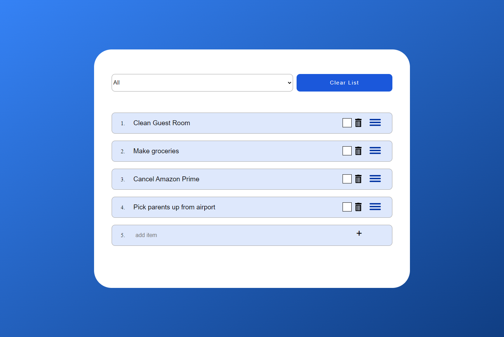

# to-do-list
A to-do-list made with Javascript.\
\
This to-do list utilizes javascript animation techniques and css styling.  
It also accesses local memory to restore your list on your next visit.  

Did you arrange your to-dos in the wrong order?  
No worries! Just drag and drop the items into the correct locations.  
All items are editable and can be deleted.  
This list can also be sorted based on whether items have been completed or not.

